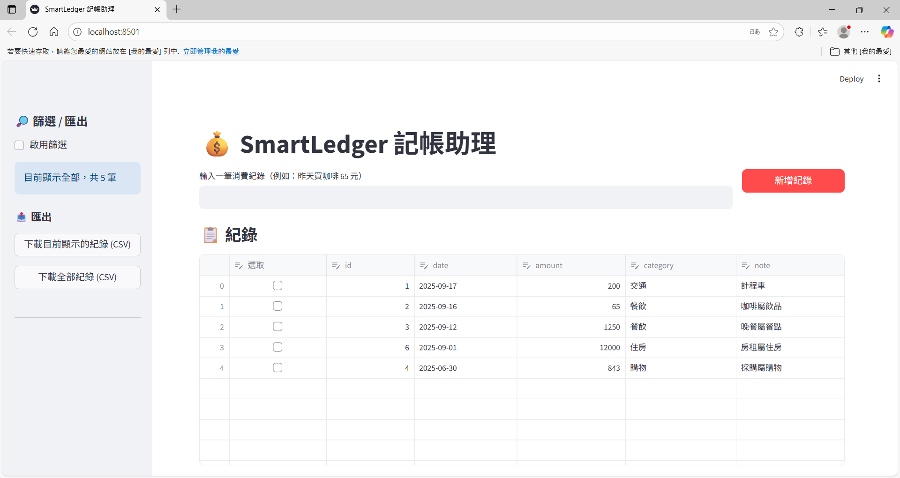
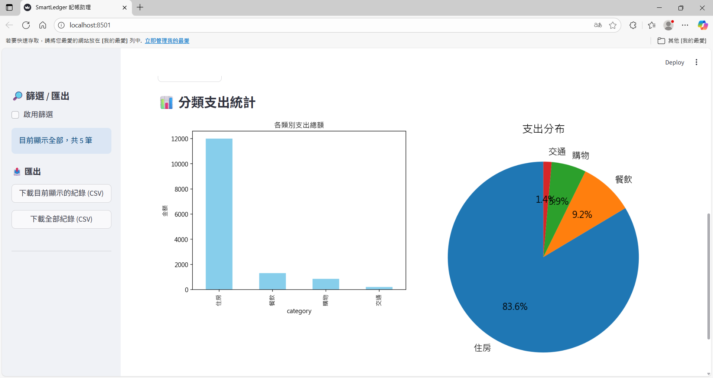
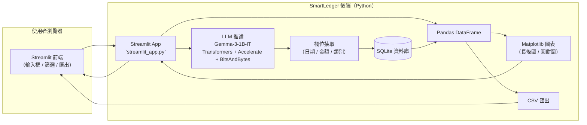

# 🖥️ SmartLedger: Expense Tracker + AI Assistant

這是一個基於 **Streamlit** 的 Web App，實作「智慧記帳助理 Demo」，整合了資料庫紀錄管理、自然語言輸入與 AI 模型推論。  

---

## 🎯 功能目標

### (a) 自然語言輸入
- 使用者可在網頁上輸入文字，例如：  
  - 「我今天花了 200 元搭計程車」  
  - 「昨天在超商買咖啡 65 元」  

### (b) LLM 分析
- 使用 LLM（本專案使用 **Gemma-3-1B-IT**）解析輸入文字，並自動抽取以下欄位：  
  - **日期**  
  - **金額**  
  - **類別**（如：餐飲、交通、購物…）  

### (c) 資料庫儲存
- 紀錄會自動存入 SQLite 資料庫，方便後續查詢與匯出  

### (d) 動態圖表顯示
- **表格**：顯示所有紀錄（日期、金額、類別）  
- **圖表**：以長條圖與圓餅圖呈現支出分布  
- **即時刷新**：每次新增紀錄後，表格與圖表即時更新  


## 📷 介面展示 (Screenshots)

### 記帳介面


### 視覺化圖表


## 🧭 系統架構



## ⚙️ 安裝與使用

### 1. 建立虛擬環境
```bash
conda create -n expense_ai python=3.12 -y
conda activate expense_ai
```

### 2. 安裝需求套件
```bash
pip install -r requirements.txt
```

### 3. 執行 Streamlit App
```bash
streamlit run streamlit_app.py
```

